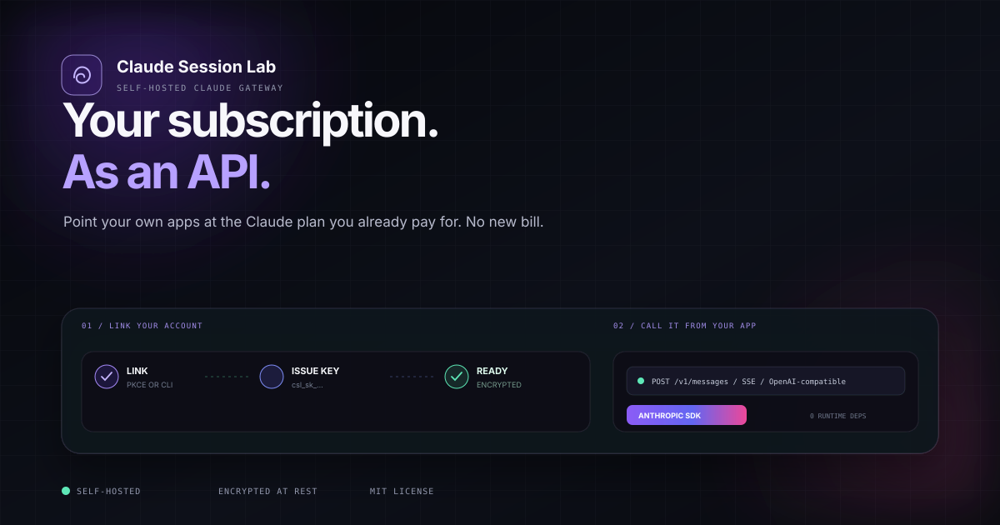
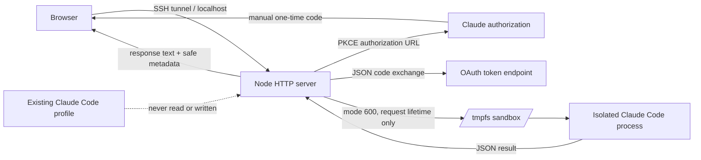

<p align="center">
  
</p>

<h1 align="center">Claude Session Lab</h1>

<p align="center">
  A localhost-only security lab for exploring isolated Claude subscription OAuth and inference.
</p>

<p align="center">
  <a href="https://github.com/asinadarsh/claude-session-lab/actions/workflows/ci.yml"></a>
  <a href="LICENSE"></a>
  
  
  <a href="https://github.com/asinadarsh/claude-session-lab/stargazers"></a>
</p>

> [!IMPORTANT]
> This is an **experimental, unofficial research project**. It is not affiliated with, endorsed by, or supported by Anthropic. It mirrors private implementation details observed in Claude Code 2.1.207, so the flow can change or stop working without notice. Use only accounts you own or are authorized to test, and review the applicable service terms before use.

## Why this exists

Connecting a browser UI to a subscription credential is easy to prototype and easy to get dangerously wrong. Claude Session Lab is a compact reference implementation focused on the hard parts:

- separating a test account from an existing Claude Code profile;
- keeping access and refresh tokens out of browser JavaScript;
- validating PKCE state and consuming authorization attempts once;
- preventing concurrent refresh-token rotation;
- running inference inside a short-lived, tool-disabled Claude Code sandbox;
- proving that temporary credentials disappear after every request.

It is intentionally a **lab**, not a multi-user identity platform or production gateway.

## What you get

- **Direct PKCE flow** matching Claude Code 2.1.207's manual authorization path.
- **Polished custom UI** with Prepare, Authorize, Exchange, and Connected stages.
- **Server-side token custody** with no credential-reveal endpoint.
- **Ephemeral inference sandboxes** under `/dev/shm` when available.
- **Strict localhost boundary** enforced in code, not only in startup flags.
- **Origin, Host, CSRF, body-size, timeout, and output-size controls**.
- **Zero runtime dependencies** - only Node.js built-ins are used.
- **Focused tests** for OAuth shape, redaction, refresh handoff, and hung-process cleanup.

## Architecture



The browser receives a random HttpOnly session cookie, a CSRF token, sanitized account metadata, and model output. OAuth tokens stay in server memory. During inference they are materialized only inside a fresh mode-700 sandbox, imported back if Claude Code refreshes them, and deleted in `finally`.

## Quick start

### Prerequisites

- Linux host or VPS
- Node.js 24 or newer
- Claude Code installed and available as `claude`
- A separate test Claude subscription you control
- SSH access if the app runs on a remote host

```bash
git clone https://github.com/asinadarsh/claude-session-lab.git
cd claude-session-lab
npm test
npm run check
./run.sh
```

The server listens on `127.0.0.1:3210` and cannot be switched to a public interface through an environment variable.

From your workstation, keep an SSH tunnel open:

```bash
ssh -N -L 3210:127.0.0.1:3210 user@your-server
```

Then open <http://127.0.0.1:3210>.

### First connection

1. Select **Prepare secure sign-in**.
2. Open the generated Claude authorization page.
3. Verify that you are using the intended **test account**.
4. Approve access and paste the one-time code into the lab.
5. Run the **Connection proof** prompt.
6. Select **Disconnect and revoke** when testing is complete.

Never paste an authorization code into an issue, chat, terminal history, or screenshot.

## Security model

| Boundary | Control |
|---|---|
| Network | Hard-bound to `127.0.0.1`; exact Host and Origin allowlists |
| Browser session | Random HttpOnly, SameSite=Strict cookie plus independent CSRF token |
| OAuth transaction | 32-byte verifier, S256 challenge, random state, 10-minute expiry, one-time consumption |
| Token storage | Process memory; no token fields in API responses or browser storage |
| Inference | Separate HOME, config, cache, temp, working directory, disabled tools and telemetry |
| Filesystem | Mode-700 sandbox and mode-600 temporary credential file |
| Concurrency | One active inference per browser session |
| Failure handling | Bounded network/process timeouts, output limits, process-group termination, redacted errors |
| Logging | Method, path, status, duration, request ID - never request bodies or credentials |

Read the full [security model](docs/SECURITY_MODEL.md) before adapting this code.

## Configuration

| Variable | Default | Purpose |
|---|---|---|
| `SESSION_LAB_PORT` | `3210` | Loopback port, from 1024 through 65535 |
| `CLAUDE_BINARY` | `claude` | Claude Code executable name or absolute path |
| `NODE_BINARY` | `node` | Node executable used by `run.sh` |

Example:

```bash
SESSION_LAB_PORT=4321 CLAUDE_BINARY="$HOME/.local/bin/claude" ./run.sh
```

The application does not load `.env` files. `.env.example` is documentation only.

## API surface

| Route | Method | Purpose |
|---|---|---|
| `/api/health` | GET | Local health check |
| `/api/auth/status` | GET | Safe connection metadata and CSRF bootstrap |
| `/api/auth/start` | POST | Create a one-time PKCE transaction |
| `/api/auth/complete` | POST | Validate and exchange the manual code |
| `/api/chat` | POST | Run one isolated, tool-disabled inference |
| `/api/auth/disconnect` | POST | Clear memory and attempt refresh-token revocation |

There is deliberately no route that returns, exports, or displays credentials.

## Tests

```bash
npm test       # 13 focused tests
npm run check  # JavaScript syntax checks
```

The suite includes a fake Claude executable that updates placeholder credentials and another that hangs until the process-group timeout kills it. No real account is needed for automated tests.

## Known limitations

- The OAuth contract is private and version-sensitive; see [protocol notes](docs/PROTOCOL_NOTES.md).
- Tokens are intentionally nonpersistent. Restarting the server requires authorization again.
- This is a single-process, in-memory demo, not a multi-tenant service.
- The UI assumes access through localhost or an SSH tunnel; do not publish the port.
- Automated tests do not call Anthropic or require a Claude subscription.

## Project structure

```text
public/                  Browser UI
src/server.mjs           HTTP/session boundary
src/oauth.mjs            PKCE URL, exchange, profile, revoke
src/claude.mjs           Ephemeral Claude Code runner
src/security.mjs         State, cookies, masking, redaction
test/                    Node test suite
docs/                    Protocol and threat-model notes
design-system/           UI design source of truth
```

## Responsible use

Do not deploy this as a public login service, collect credentials for other people, bypass account controls, or use accounts you do not own. If you discover a vulnerability, follow [SECURITY.md](SECURITY.md) rather than opening a public exploit report.

## Contributing

Issues and focused pull requests are welcome. Start with [CONTRIBUTING.md](CONTRIBUTING.md) and preserve the security invariants above.

If this project helps your OAuth or sandboxing research, consider starring it so other builders can find it.

## License and trademarks

Released under the [MIT License](LICENSE).

Claude and Claude Code are trademarks of Anthropic PBC. This project is independent and uses those names only to describe interoperability and research targets.
