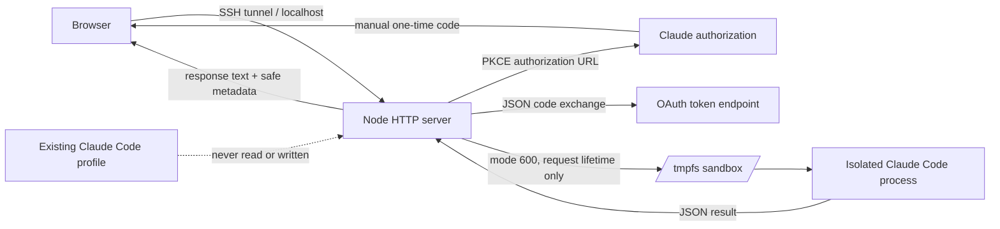

<p align="center">
  
</p>

<h1 align="center">Claude Session Lab</h1>

<p align="center">
  A localhost-only security lab for exploring isolated Claude subscription OAuth and inference.
</p>

<p align="center">
  <a href="https://github.com/asinadarsh/claude-session-lab/actions/workflows/ci.yml"></a>
  <a href="LICENSE"></a>
  
  
  <a href="https://github.com/asinadarsh/claude-session-lab/stargazers"></a>
</p>

> [!IMPORTANT]
> This is an **experimental, unofficial research project**. It is not affiliated with, endorsed by, or supported by Anthropic. It mirrors private implementation details observed in Claude Code 2.1.207, so the flow can change or stop working without notice. Use only accounts you own or are authorized to test, and review the applicable service terms before use.

## Why this exists

Connecting a browser UI to a subscription credential is easy to prototype and easy to get dangerously wrong. Claude Session Lab is a compact reference implementation focused on the hard parts:

- separating a test account from an existing Claude Code profile;
- keeping access and refresh tokens out of browser JavaScript;
- validating PKCE state and consuming authorization attempts once;
- preventing concurrent refresh-token rotation;
- running inference inside a short-lived, tool-disabled Claude Code sandbox;
- proving that temporary credentials disappear after every request.

It is intentionally a **lab**, not a multi-user identity platform or production gateway.

## What you get

- **Direct PKCE flow** matching Claude Code 2.1.207's manual authorization path.
- **Polished custom UI** with Prepare, Authorize, Exchange, and Connected stages.
- **Server-side token custody** with no credential-reveal endpoint.
- **Ephemeral inference sandboxes** under `/dev/shm` when available.
- **Strict localhost boundary** for the admin UI, enforced in code, not only in startup flags.
- **Origin, Host, CSRF, body-size, timeout, and output-size controls**.
- **Optional gateway mode** that serves your own linked account over an Anthropic- and OpenAI-compatible API.
- **Zero runtime dependencies** - only Node.js built-ins are used.
- **Focused tests** for OAuth shape, redaction, refresh handoff, hung-process cleanup, keystore crypto, wire translation, and the live HTTP surface.

## Gateway mode: your subscription as an API

Gateway mode is off by default. When it is on, an account you link is served to **your own** websites and apps behind a key you issue, using the Anthropic Messages wire format and an OpenAI-compatible shim, so existing clients work by changing two settings.

```js
import Anthropic from '@anthropic-ai/sdk';

const anthropic = new Anthropic({
  apiKey: 'csl_sk_...',            // issued by this server, not an Anthropic key
  baseURL: 'https://your-host',    // reverse proxy in front of the gateway
});

const message = await anthropic.messages.create({
  model: 'claude-sonnet-5',
  max_tokens: 1024,
  messages: [{ role: 'user', content: 'Hello' }],
});
```

| Endpoint | Purpose |
|---|---|
| `POST /v1/messages` | Anthropic Messages subset, buffered or SSE streaming |
| `POST /v1/chat/completions` | OpenAI chat-completions subset, buffered or streaming |
| `GET /v1/models` | Model list for clients that probe it |

Enable it with a master key, then link an account:

```bash
export SESSION_LAB_GATEWAY=1
export SESSION_LAB_MASTER_KEY="$(openssl rand -base64 32)"
npm start

# either issue a key from the admin UI after the PKCE flow,
# or link the account this machine is already signed in to:
npm run link-local -- my-website
```

Read [docs/API.md](docs/API.md) for the request and response contract and [docs/DEPLOY.md](docs/DEPLOY.md) for the systemd unit and the Caddy block that exposes only `/v1/*` while keeping the admin UI on an SSH tunnel.

**What is different from the real Anthropic API.** Conversation history is flattened into a single prompt, so one request costs one model turn no matter how long the thread is. Tool use, `tool_result`, and image URL sources are rejected rather than silently ignored. `max_tokens` is a soft clamp with a 256 floor. Thinking blocks are hidden unless the caller asks for them. Requests are serialized per linked account, because two concurrent runs would both rotate the OAuth refresh token.

> [!IMPORTANT]
> A subscription is metered per five-hour window and is not a resale license. Link only accounts you own, keep keys to your own apps, and do not sell or share gateway access. Review the applicable service terms before enabling this mode.

## Architecture



The browser receives a random HttpOnly session cookie, a CSRF token, sanitized account metadata, and model output. OAuth tokens stay in server memory. During inference they are materialized only inside a fresh mode-700 sandbox, imported back if Claude Code refreshes them, and deleted in `finally`.

## Quick start

### Prerequisites

- Linux host or VPS
- Node.js 24 or newer
- Claude Code installed and available as `claude`
- A separate test Claude subscription you control
- SSH access if the app runs on a remote host

```bash
git clone https://github.com/asinadarsh/claude-session-lab.git
cd claude-session-lab
npm test
npm run check
./run.sh
```

The server listens on `127.0.0.1:3210` and cannot be switched to a public interface through an environment variable.

From your workstation, keep an SSH tunnel open:

```bash
ssh -N -L 3210:127.0.0.1:3210 user@your-server
```

Then open <http://127.0.0.1:3210>.

### First connection

1. Select **Prepare secure sign-in**.
2. Open the generated Claude authorization page.
3. Verify that you are using the intended **test account**.
4. Approve access and paste the one-time code into the lab.
5. Run the **Connection proof** prompt.
6. Select **Disconnect and revoke** when testing is complete.

Never paste an authorization code into an issue, chat, terminal history, or screenshot.

## Security model

| Boundary | Control |
|---|---|
| Network | Hard-bound to `127.0.0.1`; exact Host and Origin allowlists |
| Browser session | Random HttpOnly, SameSite=Strict cookie plus independent CSRF token |
| OAuth transaction | 32-byte verifier, S256 challenge, random state, 10-minute expiry, one-time consumption |
| Token storage | Process memory; no token fields in API responses or browser storage |
| Inference | Separate HOME, config, cache, temp, working directory, disabled tools and telemetry |
| Filesystem | Mode-700 sandbox and mode-600 temporary credential file |
| Concurrency | One active inference per browser session |
| Failure handling | Bounded network/process timeouts, output limits, process-group termination, redacted errors |
| Logging | Method, path, status, duration, request ID - never request bodies or credentials |

Read the full [security model](docs/SECURITY_MODEL.md) before adapting this code.

## Configuration

| Variable | Default | Purpose |
|---|---|---|
| `SESSION_LAB_PORT` | `3210` | Listening port, from 1024 through 65535 |
| `CLAUDE_BINARY` | `claude` | Claude Code executable name or absolute path |
| `NODE_BINARY` | `node` | Node executable used by `run.sh` |
| `SESSION_LAB_GATEWAY` | `0` | Enable `/v1/*` and the encrypted keystore |
| `SESSION_LAB_MASTER_KEY` | none | 32 bytes, base64 or hex; required by gateway mode |
| `SESSION_LAB_KEYSTORE` | `data/keystore.json` | Encrypted connection store |
| `SESSION_LAB_HOST` | `127.0.0.1` | Bind address; anything else also needs `SESSION_LAB_ALLOW_PUBLIC_BIND=1` |
| `SESSION_LAB_CORS_ORIGINS` | none | Comma-separated origins allowed to call `/v1/*` from a browser |
| `SESSION_LAB_RATE_LIMIT_PER_MINUTE` | `60` | Requests per minute per key |
| `SESSION_LAB_QUEUE_LIMIT` | `4` | Requests that may wait for one account's lock |
| `SESSION_LAB_MAX_BODY_KB` | `8192` | Gateway request-body ceiling, sized for base64 images |
| `SESSION_LAB_MAX_IMAGES` | `6` | Image blocks allowed per request |
| `SESSION_LAB_REQUEST_TIMEOUT_S` | `600` | Gateway inference deadline |

Full defaults are listed in [docs/DEPLOY.md](docs/DEPLOY.md).

Example:

```bash
SESSION_LAB_PORT=4321 CLAUDE_BINARY="$HOME/.local/bin/claude" ./run.sh
```

The application does not load `.env` files. `.env.example` is documentation only.

## API surface

| Route | Method | Auth | Purpose |
|---|---|---|---|
| `/api/health` | GET | none | Health check |
| `/api/auth/status` | GET | cookie | Safe connection metadata and CSRF bootstrap |
| `/api/auth/start` | POST | cookie + CSRF | Create a one-time PKCE transaction |
| `/api/auth/complete` | POST | cookie + CSRF | Validate and exchange the manual code |
| `/api/chat` | POST | cookie + CSRF | Run one isolated, tool-disabled inference |
| `/api/keys/create` | POST | cookie + CSRF | Link the connected account and issue one key |
| `/api/keys/revoke` | POST | cookie + CSRF | Revoke a key and its stored token |
| `/api/auth/disconnect` | POST | cookie + CSRF | Clear memory and attempt refresh-token revocation |
| `/v1/messages` | POST | gateway key | Anthropic Messages, buffered or streaming |
| `/v1/chat/completions` | POST | gateway key | OpenAI chat completions, buffered or streaming |
| `/v1/models` | GET | gateway key | Model list |

Every `/api/*` route requires the localhost Host allowlist; only `/v1/*` is meant to be proxied publicly. There is deliberately no route that returns, exports, or displays credentials, and a gateway key is shown exactly once at creation.

## Tests

```bash
npm test       # 74 tests
npm run check  # JavaScript syntax checks
```

The suite uses fake `claude` executables: one echoes a scripted stream-json conversation, one hangs until the process-group timeout kills it, and one fails if a second run overlaps, which is how per-account serialization is asserted. `test/gateway.test.mjs` boots the real server against a seeded keystore and exercises the full HTTP surface. No real account is needed for automated tests.

## Known limitations

- The OAuth contract is private and version-sensitive; see [protocol notes](docs/PROTOCOL_NOTES.md).
- In lab mode tokens are never persisted, so restarting requires authorization again. Gateway mode persists them encrypted, and losing the master key makes them unrecoverable by design.
- Single process, single owner. This is not a multi-tenant platform: there is no billing, quota, or per-caller isolation beyond the key.
- Requests are serialized per linked account, so throughput is one inference at a time.
- The admin UI assumes localhost or an SSH tunnel; do not publish its port.
- Automated tests do not call Anthropic or require a Claude subscription.

## Project structure

```text
public/                  Browser UI
src/server.mjs           HTTP/session boundary and route table
src/oauth.mjs            PKCE URL, exchange, profile, revoke
src/keystore.mjs         Encrypted connection store and API keys
src/gateway.mjs          Key auth, per-account locking, rate limits
src/messages.mjs         Anthropic request/response and SSE translation
src/openai.mjs           OpenAI compatibility shim
src/claude.mjs           Ephemeral Claude Code runner
src/security.mjs         State, cookies, masking, redaction
scripts/link-local.mjs   Link the account this machine already uses
test/                    Node test suite
docs/                    API, deployment, protocol, threat model
design-system/           UI design source of truth
```

## Responsible use

Do not deploy this as a public login service, collect credentials for other people, bypass account controls, or use accounts you do not own. If you discover a vulnerability, follow [SECURITY.md](SECURITY.md) rather than opening a public exploit report.

## Contributing

Issues and focused pull requests are welcome. Start with [CONTRIBUTING.md](CONTRIBUTING.md) and preserve the security invariants above.

If this project helps your OAuth or sandboxing research, consider starring it so other builders can find it.

## License and trademarks

Released under the [MIT License](LICENSE).

Claude and Claude Code are trademarks of Anthropic PBC. This project is independent and uses those names only to describe interoperability and research targets.
