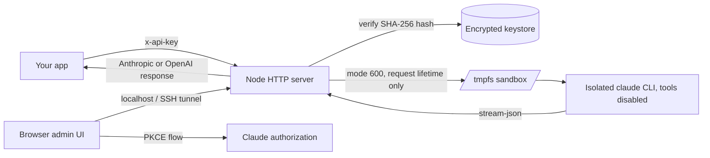

<p align="center">
  
</p>

<h1 align="center">Claude Session Lab</h1>

<p align="center">
  <b>Use your own Claude subscription as an API in your own websites and apps.</b><br>
  Self-hosted. Anthropic- and OpenAI-compatible. Zero runtime dependencies.
</p>

<p align="center">
  <a href="https://github.com/asinadarsh/claude-session-lab/actions/workflows/ci.yml"></a>
  <a href="LICENSE"></a>
  
  
  <a href="https://github.com/asinadarsh/claude-session-lab/stargazers"></a>
</p>

---

You already pay for Claude. This runs on your own machine, links **your** account, and gives you an API key your code can use:

```js
import Anthropic from '@anthropic-ai/sdk';

const anthropic = new Anthropic({
  apiKey: 'csl_sk_...',              // issued by your server
  baseURL: 'http://127.0.0.1:3210',  // your server
});

const message = await anthropic.messages.create({
  model: 'claude-sonnet-5',
  max_tokens: 1024,
  messages: [{ role: 'user', content: 'Hello' }],
});
```

Two settings changed. Everything else in your app stays the same. The official Anthropic SDK, the OpenAI SDK, curl, and the Vercel AI SDK all work.

> [!IMPORTANT]
> **Read this before you start.** This is an unofficial, experimental project, not affiliated with or supported by Anthropic. It drives the `claude` CLI with credentials you already own, and it relies on private implementation details, so it can break without notice.
>
> Link only accounts **you** own. A subscription is metered per five-hour window and is **not a resale license** — do not sell or share gateway access, and review the applicable service terms before you enable it. Everything here assumes one owner serving their own apps.

## Quickstart

Five minutes, five steps. Developed and tested on Linux; macOS should work too (the sandbox falls back from `/dev/shm` to `TMPDIR`).

**You need:** Node.js 24+, the `claude` CLI installed and signed in (`claude` then `/login`), and a Claude subscription you own.

```bash
# 1. Get the code and check it runs
git clone https://github.com/asinadarsh/claude-session-lab.git
cd claude-session-lab
npm test

# 2. Turn on gateway mode with a master key (this encrypts your stored token)
export SESSION_LAB_GATEWAY=1
export SESSION_LAB_MASTER_KEY="$(openssl rand -base64 32)"

# 3. Link the account this machine is already signed in to, and get your key
npm run link-local -- my-app

# 4. Start the server
npm start
```

Step 3 prints your key once:

```
Linked ed********@gmail.com (max) as "my-app".

Gateway key (shown once, store it now):
csl_sk_XXXXXXXXXXXXXXXXXXXXXXXXXXXXXXXX
```

```bash
# 5. Call it (new terminal)
curl http://127.0.0.1:3210/v1/messages \
  -H "x-api-key: csl_sk_XXXXXXXXXXXXXXXXXXXXXXXXXXXXXXXX" \
  -H "content-type: application/json" \
  -d '{"model":"claude-sonnet-5","max_tokens":100,
       "messages":[{"role":"user","content":"Reply with exactly: it works"}]}'
```

```json
{"type":"message","role":"assistant","content":[{"type":"text","text":"it works"}],
 "stop_reason":"end_turn","usage":{"input_tokens":175,"output_tokens":5}}
```

That's it. Point your app at `http://127.0.0.1:3210` with that key.

> [!TIP]
> Save the master key somewhere safe. It encrypts the stored token, and there is no recovery if you lose it — you would just re-link. Put both it and `SESSION_LAB_GATEWAY=1` in your shell profile so the server picks them up every time.

## Use it from your app

<details open>
<summary><b>Node — Anthropic SDK</b></summary>

```js
import Anthropic from '@anthropic-ai/sdk';

const anthropic = new Anthropic({ apiKey: process.env.CSL_KEY, baseURL: 'http://127.0.0.1:3210' });

// Buffered
const message = await anthropic.messages.create({
  model: 'claude-sonnet-5',
  max_tokens: 1024,
  messages: [{ role: 'user', content: 'Write a haiku about caching.' }],
});
console.log(message.content[0].text);

// Streaming
const stream = await anthropic.messages.stream({
  model: 'claude-sonnet-5',
  max_tokens: 1024,
  messages: [{ role: 'user', content: 'Count to five.' }],
});
stream.on('text', (text) => process.stdout.write(text));
await stream.finalMessage();
```
</details>

<details>
<summary><b>Python — Anthropic SDK</b></summary>

```python
from anthropic import Anthropic

client = Anthropic(api_key=os.environ["CSL_KEY"], base_url="http://127.0.0.1:3210")

message = client.messages.create(
    model="claude-sonnet-5",
    max_tokens=1024,
    messages=[{"role": "user", "content": "Write a haiku about caching."}],
)
print(message.content[0].text)
```
</details>

<details>
<summary><b>OpenAI SDK (Node and Python)</b> — for apps already written against OpenAI</summary>

Note the `/v1` on the end: the OpenAI clients append paths to whatever you give them.

```js
import OpenAI from 'openai';

const openai = new OpenAI({ apiKey: process.env.CSL_KEY, baseURL: 'http://127.0.0.1:3210/v1' });

const completion = await openai.chat.completions.create({
  model: 'claude-sonnet-5',
  messages: [
    { role: 'system', content: 'Answer in one word.' },
    { role: 'user', content: 'Largest planet?' },
  ],
});
console.log(completion.choices[0].message.content);
```

```python
from openai import OpenAI

client = OpenAI(api_key=os.environ["CSL_KEY"], base_url="http://127.0.0.1:3210/v1")
completion = client.chat.completions.create(
    model="claude-sonnet-5",
    messages=[{"role": "user", "content": "Largest planet?"}],
)
print(completion.choices[0].message.content)
```
</details>

<details>
<summary><b>Vercel AI SDK</b></summary>

```js
import { createAnthropic } from '@ai-sdk/anthropic';
import { generateText } from 'ai';

const anthropic = createAnthropic({ apiKey: process.env.CSL_KEY, baseURL: 'http://127.0.0.1:3210/v1' });

const { text } = await generateText({
  model: anthropic('claude-sonnet-5'),
  prompt: 'Write a haiku about caching.',
});
```

Tool calling will fail — this gateway runs with tools disabled.
</details>

<details>
<summary><b>Images (vision)</b></summary>

Base64 image blocks work. URL sources do not — fetch the image yourself and send the bytes.

```js
const message = await anthropic.messages.create({
  model: 'claude-sonnet-5',
  max_tokens: 300,
  messages: [{
    role: 'user',
    content: [
      { type: 'image', source: { type: 'base64', media_type: 'image/png', data: base64Png } },
      { type: 'text', text: 'What is in this image?' },
    ],
  }],
});
```
</details>

Endpoints: `POST /v1/messages`, `POST /v1/chat/completions`, `GET /v1/models`. Full request and response contract in **[docs/API.md](docs/API.md)**.

## What works, and what doesn't

| Works | Notes |
|---|---|
| Multi-turn conversations | Full history, flattened into one prompt |
| Streaming (SSE) | Both endpoints; real Anthropic event sequence |
| Images | Base64 blocks, up to 6 per request by default |
| System prompts | String or block array |
| Model selection | `sonnet`, `opus`, `haiku`, or any `claude-*` id |
| Thinking blocks | Hidden by default; send `thinking: { type: 'enabled' }` to receive the ones the model produces. It does not force thinking — the gateway cannot set a thinking budget |
| Multiple keys | One per app, each revocable |

| Not supported | Why, and what happens |
|---|---|
| Tool use / function calling | The sandbox runs with tools disabled. Sending `tools` returns `400` rather than silently ignoring them and leaving your app waiting for a `tool_use` block. |
| `stop_sequences` / OpenAI `stop` | The CLI exposes no stop-sequence control, so this returns `400`. Trim the response on your side. |
| Image URL sources | Returns `400`. Send base64. |
| `temperature`, `top_p`, `seed`, … | Silently ignored — the CLI has no sampling controls. |
| Parallel requests per account | Serialized. Two concurrent runs would both rotate the OAuth token and invalidate each other. |

**One request costs one model turn**, regardless of how long the conversation is — history is flattened into a single prompt rather than replayed turn by turn. `max_tokens` is a soft clamp with a 256 floor. Token counts come from the CLI and are approximate.

## Managing keys

Issue one key per app so you can revoke them independently.

```bash
# Stop the server first: it holds an exclusive lock on the keystore.
npm run link-local -- another-app
```

Or use the browser UI, which also works while the server is running, and lets you link a **different** Claude account through the OAuth flow:

```bash
# Local server: just open it.
open http://127.0.0.1:3210

# Remote server: tunnel first, then open the same URL locally.
ssh -N -L 3210:127.0.0.1:3210 you@your-server
```

The UI shows every linked account, its usage counters, and a **Revoke** button. Keys are shown once and stored only as a SHA-256 hash, so a leaked keystore does not leak usable keys.

> [!NOTE]
> `link-local` copies the refresh token that Claude Code on the same machine uses. When either side refreshes, the other may need to sign in again. Link a separate account through the browser UI if that matters to you.

## Going public

The server binds `127.0.0.1` and the admin UI refuses non-localhost `Host` headers. To serve real traffic, put a reverse proxy in front that forwards **only** `/v1/*`:

```caddy
gateway.example.com {
  @api path /v1/*
  handle @api {
    reverse_proxy 127.0.0.1:3210
  }
  handle {
    respond "Not found" 404
  }
}
```

Then your apps use `baseURL: 'https://gateway.example.com'`, and you reach the admin UI over an SSH tunnel. **[docs/DEPLOY.md](docs/DEPLOY.md)** has the full walkthrough: systemd unit, non-root service user, firewall, backups, and verification steps.

Browser apps calling the gateway directly need their origin allowlisted:

```bash
export SESSION_LAB_CORS_ORIGINS="https://myapp.com"
```

## Troubleshooting

| What you see | What it means |
|---|---|
| `KEYSTORE_LOCKED` from `link-local` | The server is running and holds the keystore. Stop it, or use the browser UI. |
| `503 GATEWAY_DISABLED` | `SESSION_LAB_GATEWAY=1` is not set in the server's environment. |
| `MASTER_KEY_INVALID` at startup | `SESSION_LAB_MASTER_KEY` must be 32 bytes: `openssl rand -base64 32`. |
| `KEYSTORE_UNREADABLE` at startup | Wrong master key for an existing `data/keystore.json`, or the file was edited. Restore the right key. |
| `401 API_KEY_INVALID` | Wrong or revoked key. Keys are shown once; issue a new one. |
| `401 CLAUDE_AUTH_REQUIRED` | The linked account's tokens no longer work. Re-link it. |
| `429 CLAUDE_RATE_LIMITED` | Your subscription hit its five-hour window. Wait it out. |
| `429 CONCURRENCY_LIMIT` | Too many requests queued for one account; they run one at a time. |
| `421 HOST_NOT_ALLOWED` | You reached `/api/*` without localhost. Use the SSH tunnel. |
| `500 CLAUDE_BINARY_MISSING` | Set `CLAUDE_BINARY` to an absolute path, e.g. `$HOME/.local/bin/claude`. |
| Server exits at startup, mentions the bind address | Binding off-localhost also needs `SESSION_LAB_ALLOW_PUBLIC_BIND=1`. Prefer a reverse proxy. |

Logs are one JSON line per request (method, path, status, duration, request id) and never contain request bodies, keys, or tokens. Every error response carries an `X-Request-ID` you can grep for.

## How it works



A request authenticates against a hashed key, the OAuth token is decrypted from the keystore, and a fresh mode-700 sandbox is created with its own `HOME` and `CLAUDE_CONFIG_DIR`. The `claude` CLI runs there with tools disabled, no session persistence, and no access to your own settings or MCP servers. The sandbox and its credential file are destroyed when the request ends — including on crash or forced exit. If the CLI rotates the OAuth token, the new token is encrypted back into the keystore.

## Security model

| Boundary | Control |
|---|---|
| Network | Binds `127.0.0.1` unless explicitly overridden; the admin UI enforces exact Host and Origin allowlists, so only `/v1/*` is proxyable |
| Gateway keys | Shown once, stored only as SHA-256, revocable, rate-limited and queue-capped per key |
| Token storage | AES-256-GCM at rest under your master key, bound to the record id; in lab mode, memory only. No token appears in any API response, log line, or browser payload |
| Keystore integrity | Exclusive lock for the process lifetime, atomic writes with `fsync` before rename, decrypt-on-open verification |
| Browser session | Random HttpOnly, SameSite=Strict cookie plus an independent CSRF token |
| OAuth transaction | 32-byte verifier, S256 challenge, random state, 10-minute expiry, one-time consumption |
| Inference | Separate HOME, config, cache, temp and working directory; tools, MCP servers, host settings and telemetry all disabled |
| Concurrency | One inference per linked account, across every key and the admin UI, so refresh-token rotations cannot race |
| Failure handling | Bounded timeouts, output limits, process-group termination, client-disconnect cancellation, redacted errors |

Full threat model in **[docs/SECURITY_MODEL.md](docs/SECURITY_MODEL.md)**. Found a vulnerability? See [SECURITY.md](SECURITY.md) rather than opening a public exploit report.

## Configuration

Everything is an environment variable; the app deliberately does not read `.env` files. See [`.env.example`](.env.example) for the annotated list.

| Variable | Default | Purpose |
|---|---|---|
| `SESSION_LAB_GATEWAY` | `0` | Enable `/v1/*` and the encrypted keystore |
| `SESSION_LAB_MASTER_KEY` | none | 32 bytes, base64 or hex; required by gateway mode |
| `SESSION_LAB_PORT` | `3210` | Listening port |
| `CLAUDE_BINARY` | `claude` | Path to the Claude Code executable |
| `SESSION_LAB_KEYSTORE` | `data/keystore.json` | Encrypted connection store |
| `SESSION_LAB_HOST` | `127.0.0.1` | Bind address; off-localhost also needs `SESSION_LAB_ALLOW_PUBLIC_BIND=1` |
| `SESSION_LAB_CORS_ORIGINS` | none | Comma-separated origins allowed to call `/v1/*` from a browser |
| `SESSION_LAB_RATE_LIMIT_PER_MINUTE` | `60` | Requests per minute per key |
| `SESSION_LAB_QUEUE_LIMIT` | `4` | Requests that may wait for one account's lock |
| `SESSION_LAB_MAX_BODY_KB` | `8192` | Request-body ceiling, sized for base64 images |
| `SESSION_LAB_MAX_IMAGES` | `6` | Image blocks per request |
| `SESSION_LAB_REQUEST_TIMEOUT_S` | `600` | Inference deadline |
| `SESSION_LAB_DEFAULT_MAX_TOKENS` | `4096` | Used when a request omits `max_tokens` |

The remaining limits (`MAX_PROMPT_CHARS`, `MAX_MESSAGES`, `MAX_IMAGE_KB`, `MAX_CONNECTIONS`) are listed in [docs/DEPLOY.md](docs/DEPLOY.md).

## Lab mode

With `SESSION_LAB_GATEWAY` unset, `/v1/*` is disabled and the project is what it started as: a localhost-only reference implementation of the Claude subscription OAuth flow, for studying how to do this safely. Tokens live in memory only and are gone on restart. Run `npm start`, open <http://127.0.0.1:3210>, complete the PKCE flow, and use the prompt playground.

Useful if you want to read the OAuth and sandboxing code without persisting anything. See [docs/PROTOCOL_NOTES.md](docs/PROTOCOL_NOTES.md) for the observed protocol details.

## Development

```bash
npm test       # 83 tests, no Claude account needed
npm run check  # syntax check every source file
```

The suite uses fake `claude` executables: one replays a scripted stream-json conversation, one hangs until the process-group timeout kills it, and one fails if a second run overlaps — which is how per-account serialization is asserted. `test/gateway.test.mjs` boots the real server against a seeded keystore and drives the full HTTP surface.

```text
public/                  Browser admin UI
src/server.mjs           HTTP boundary, routes, SSE
src/gateway.mjs          Key auth, per-account locking, rate limits
src/keystore.mjs         Encrypted connection store and API keys
src/messages.mjs         Anthropic request/response and SSE translation
src/openai.mjs           OpenAI compatibility shim
src/claude.mjs           Sandboxed claude CLI runner
src/oauth.mjs            PKCE URL, exchange, profile, revoke
src/security.mjs         State, cookies, masking, redaction
scripts/link-local.mjs   Link the account this machine already uses
docs/                    API, deployment, protocol, threat model
```

Issues and focused pull requests are welcome — start with [CONTRIBUTING.md](CONTRIBUTING.md) and preserve the invariants in the security table.

If this saves you a bill, consider starring it so other people can find it.

## License and trademarks

Released under the [MIT License](LICENSE).

Claude and Claude Code are trademarks of Anthropic PBC. This project is independent and uses those names only to describe interoperability.
